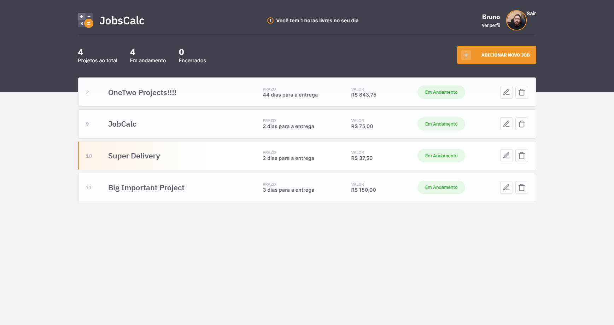

<h1 align="center">
  
</h1>

  <a href="#-tecnologias">Tecnologias</a>&nbsp;&nbsp;&nbsp;|&nbsp;&nbsp;&nbsp;
  <a href="#-meu-toque-especial">Meu Toque Especial</a>&nbsp;&nbsp;&nbsp;|&nbsp;&nbsp;&nbsp;
  <a href="#-projeto">Projeto</a>&nbsp;&nbsp;&nbsp;|&nbsp;&nbsp;&nbsp;
  <a href="#-aprendizados">Aprendizados</a>&nbsp;&nbsp;&nbsp;|&nbsp;&nbsp;&nbsp;
  <a href="#memo-licença">Licença</a>

 

  

 

  

## 🚀 Tecnologias

Esse projeto foi desenvolvido com as seguintes tecnologias durante a maratona:

- HTML
- CSS
- JavaScript
- NodeJS
- EJS
- Express
- SQLite

## 🐱‍🏍 Meu Toque especial

As funcionalidades adicionadas nesse projeto foram:

- Alteração no banco de dados e estruturas do app para permitir o acesso de múltiplos profiles.
- Criação da página de Login e Registro para novos profiles.
- Caso o usuário use o mesmo nome de usuário do Github, seu avatar será puxado automaticamente.
- Validação de quantidade de horas diárias quando criado novo job.
- Aplicação do Typescript no projeto tendo que reescrever parte do código.
- Hospedagem do aplicação.

Para essas implementações foram utilizadas as seguintes tecnologias:

- Bcrypt: Utilizada para encryptar a senha antes de salvar no banco de dados e realzar a comparação da senha durante o login
- Passport: Uso do Passport com estratégia de Local para autenticação do usuário nas páginas de acesso restrito.
- Heroku: Utilização do Heroku para automação do deploy e publicação do app na nuvem para demonstração.

## 💻 Projeto

O JobsCalc é uma aplicação de estimativa de cálculo para projetos freelancer, onde é possível cadastrar e excluir jobs (projetos), obtendo uma estimativa de custo de cada job. Além disso, é possível traçar o valor da hora da pessoa que estará usando o sistema 💰

🌎 A aplicação pode ser testada pelo <a href="https://glacial-sea-55285.herokuapp.com/">link</a>

## 🎓 Aprendizados

 - Projeto me trouxe mais habilidade na linguagem Javascript e Typescript. 
 - Pude aprender sobre o desenvolvimento do backend nessa linguagem e a parte mais legal foi ter implementado toda a parte de autenticação.

## :memo: Licença

Esse projeto está sob a licença MIT. Veja o arquivo [LICENSE](.github/LICENSE.md) para mais detalhes.

